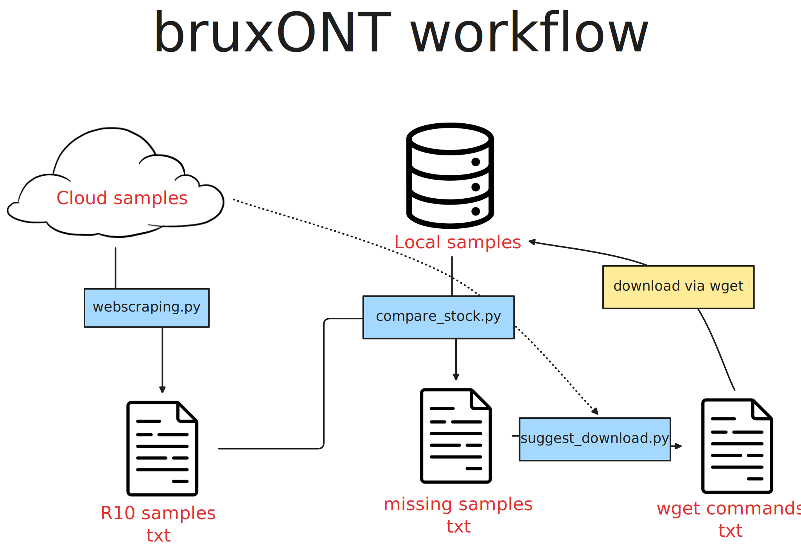

# bruxONT

This is a personal project to see if there are any new 1KG samples sequenced via ONT with R10 technology available for download from the [link](https://s3.amazonaws.com/1000g-ont/index.html?prefix=ALIGNMENT_AND_ASSEMBLY_DATA/100_PLUS/IN-HOUSE_MINIMAP2/).

Feel free to ask questions and use the code as you wish!

## Dependencies

- python3
    - Selenium;
    - re;
- googlechrome;
- chromedriver;

## Workflow

## About the name

This project is named after the football star Ronaldinho, popularly known as "O Bruxo" (the Witch) and also as R10 (the greatest R10 of all, sorry ONT!).

